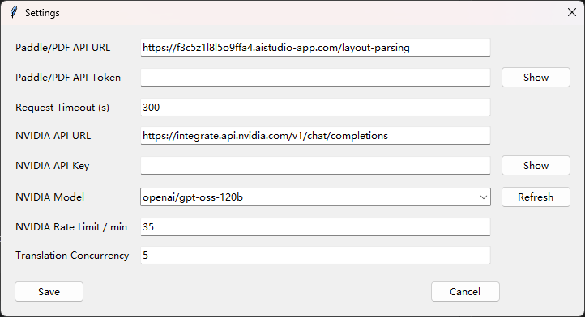

# PDF Translator Desktop App

Tkinter desktop app for:

- converting a single PDF into Markdown
- downloading extracted images into the PDF output folder
- translating Markdown into Simplified Chinese with the NVIDIA API
- saving and reusing local API settings

## Screenshots

### Main Window


## Run

From the repository root:

```bash
uv sync
uv run app.py
```

## What The App Does

The app supports two input modes.

### PDF Mode

Workflow:

1. Select a `.pdf` file.
2. Select an output directory.
3. Optionally enable Markdown translation.
4. Click `Run`.

Output:

- `OUTPUT_DIR/<pdf_name>/<pdf_name>_full.md`
- `OUTPUT_DIR/<pdf_name>/<pdf_name>_full_zh.md` if translation is enabled
- extracted images saved under `OUTPUT_DIR/<pdf_name>/`

Notes:

- PDF mode always creates a subfolder named after the PDF file.
- This is required because Markdown and extracted images must stay together.

### Markdown Mode

Workflow:

1. Select a `.md`, `.markdown`, or `.txt` file.
2. Select an output directory.
3. Click `Run`.

Output:

- `OUTPUT_DIR/<markdown_name>_zh.md`

Notes:

- Markdown mode does not create a per-file subfolder.
- The translated file is written directly into the selected output directory.

## Settings

Use the `Settings` button in the main window to edit and save:

- `Paddle/PDF API URL`
- `Paddle/PDF API Token`
- `Request Timeout (s)`
- `NVIDIA API URL`
- `NVIDIA API Key`
- `NVIDIA Model`
- `NVIDIA Rate Limit / min`
- `Translation Concurrency`

Extra behavior:

- secret fields support `Show` / `Hide`
- NVIDIA model list can be refreshed from official sources
- settings are persisted locally

### Settings Window



Saved settings are stored in:

- `app_config.json`

Path behavior:

- run from source: `app_config.json` is created in the project root
- run as packaged EXE: `app_config.json` is created next to the `.exe`

## Translation Behavior

The current translator behavior is:

- Markdown is split into chunks of about `5000` characters
- chunk translation is parallelized
- total NVIDIA request rate is limited, default `35` requests per minute
- references sections can be skipped when detected by Markdown headings
- tables, images, formulas, and algorithm blocks are protected from translation
- Markdown headings are force-translated in a post-pass for consistency
- images are normalized to centered HTML output where possible

## Logs

The app writes runtime logs to:

- `app.log`

Path behavior:

- run from source: `app.log` is created in the project root
- run as packaged EXE: `app.log` is created next to the `.exe`

Logs include:

- current phase
- translation progress in translated chars / total chars
- conversion time
- translation time
- total time
- output paths

## Environment Variables

If present, these can be used as defaults before local config is saved:

- `PDF_MD_API_URL`
- `PDF_MD_API_TOKEN`
- `PDF_MD_TIMEOUT_SECONDS`
- `NVIDIA_API_URL`
- `NVIDIA_API_KEY`
- `NVIDIA_MODEL`
- `NVIDIA_MAX_REQUESTS_PER_MINUTE`
- `TRANSLATION_CONCURRENCY`

## Build EXE

Use PyInstaller inside the `uv` environment:

```bash
uv run pyinstaller --noconfirm --clean --windowed --onefile --name pdf-translator app.py
```

Build output:

- `dist/pdf-translator.exe`

## Publish A Release

This repository can publish a Windows EXE to GitHub Releases automatically.

### One-time setup

1. Push this repository to GitHub.
2. Make sure the default branch is `main`.
3. Keep the workflow file under `.github/workflows/release.yml`.

### Release flow

Create and push a version tag:

```bash
git add .
git commit -m "Release v0.1.0"
git tag v0.1.0
git push origin main
git push origin v0.1.0
```

After the tag is pushed, GitHub Actions will:

- build `pdf-translator.exe` on Windows
- rename it to `pdf-translator-v0.1.0-windows-x64.exe`
- create or update the matching GitHub Release
- upload the EXE as a Release asset

Tag format:

- `v0.1.0`
- `v0.2.3`
- `v1.0.0`

If you want to publish manually without GitHub Actions, build locally and upload `dist/pdf-translator.exe` in the GitHub Release page.

## Current Limitations

- GUI behavior has not been fully regression-tested end to end after every change
- translation quality depends heavily on the selected NVIDIA model
- some complex OCR/layout HTML may still require more normalization
- image centering is applied to common image forms, not every possible HTML variant
